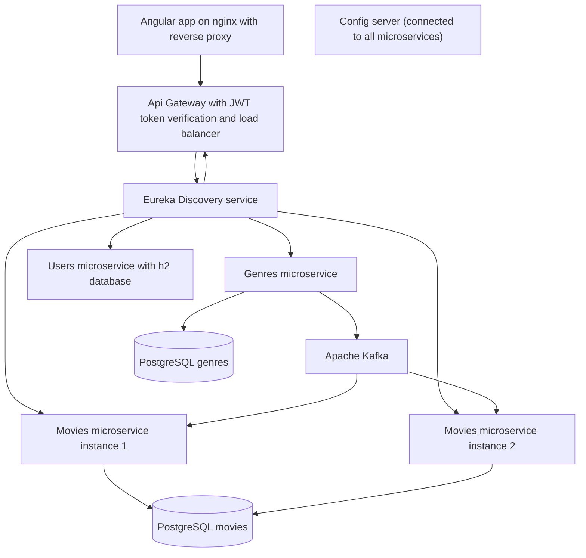

<a id="readme-top"></a>

<!-- PROJECT LOGO -->
<br />
<div align="center">
<!--   <a href="https://github.com/othneildrew/Best-README-Template">
    
  </a> -->

  <h3 align="center">Movies app</h3>

  <p align="center">
    Application for managing collections of movies
    <br />
    <a href="#demo">View Demo</a>
  </p>
</div>


<!-- TABLE OF CONTENTS -->
<details>
  <summary>Table of Contents</summary>
  <ol>
    <li>
      <a href="#about-the-project">About The Project</a>
      <ul>
        <li><a href="#built-with">Built With</a></li>
      </ul>
    </li>
    <li><a href='#demo'>Demo</a></li>
    <li>
      <a href="#getting-started">Getting Started</a>
    </li>
    <li><a href="#further-roadmap">Further Roadmap</a></li>
    <li><a href="#contributing">Contributing</a></li>
    <li><a href="#contact">Contact</a></li>
    <li><a href="#acknowledgments">Acknowledgments</a></li>
  </ol>
</details>


<!-- ABOUT THE PROJECT -->
## About The Project

### Architecture design


The project is built on a microservices architecture, where each microservice has its own dedicated database. A reverse proxy is used to route client requests to the application gateway, ensuring seamless communication. Configuration properties for each microservice are managed centrally through a config server, while Eureka Discovery Service is employed to monitor and track the location of each service. All services are containerized using Docker, with Docker Compose orchestrating the containers' lifecycle. Microservices interact via an Apache Kafka broker. Authorization and authentication are securely handled using JWT tokens.

<p align="right">(<a href="#readme-top">back to top</a>)</p>


### Built With
<p> <a href="https://angular.io"></a> The front-end of the application is built with the Angular framework, utilizing NgRx Store for state management and Angular Material for theming and reusable components. Besides Angular features such as Routing, Reactive Forms, Directives, Pipes, and Signals, Guards and Interceptors were employed for security purposes. </p> 

<p> <a href="https://spring.io"></a> Spring MVC is used to develop RESTful APIs for the application gateway and microservices. Spring Security provides robust authorization and authentication mechanisms, while Spring Cloud Netflix Eureka Server handles service discovery. </p>

<p> <a href="https://docker.com"></a> Docker ensures the containerization of the entire application, with each microservice running in its own container. Docker Compose manages the container network, and volumes are created for PostgreSQL data persistence to prevent data loss. </p>


<p> <a href="https://docker.com"></a> In this project, Apache Kafka is used for communication between two microservices. The Genres microservice acts as a message producer and sends messages to two topics: 'genre-delete' and 'genre-create'. The Movie microservice serves as a consumer and listens to these topics to ensure synchronization between the movies and genres databases.</p>

<p> <a href="https://www.postgresql.org/"></a> PostgreSQL database system is used for storing data </p>

<p><a href="https://cloud.spring.io/spring-cloud-netflix/reference/html/">Spring Cloud Netflix - Eureka</a> is crucial for tracking the location and availability of microservices.</p>

<p> <a href="https://www.liquibase.com/">Liquibase</a> is used for creating database migrations. It allows version control for database changes. 
</p>
<p align="right">(<a href="#readme-top">back to top</a>)</p>


## Demo

[Screencast from 2025-01-20 22-49-57.webm](https://github.com/user-attachments/assets/81177039-6bff-4466-bcca-17fd9cb04ded)

<!-- GETTING STARTED -->
## Getting Started


1. Clone the repo
   ```sh
   git clone https://github.com/github_username/repo_name.git
   ```
2. Install NPM packages inside the frontend folder
   ```sh
   npm install
   ```
3. Build Angular app
   ```sh
   npm run build
   ``` 
3. Add .env file based on example .env.sample 
4. Run script for building all services
   ```sh
    ./building_script.sh
   ```
5. Run application
   ```sh 
    sudo docker compose up --build -d
   ```

<p align="right">(<a href="#readme-top">back to top</a>)</p>


<!-- ROADMAP -->
## Further Roadmap


- [x] Add Apache Kafka for communication between microservices
- [x] Improve styles of the app
- [ ] Extend existed functionality 

See the [open issues](https://github.com/vetall7/isa-labs/issues) for a full list of proposed features (and known issues).

<p align="right">(<a href="#readme-top">back to top</a>)</p>


<!-- CONTRIBUTING -->
## Contributing

Contributions are what make the open source community such an amazing place to learn, inspire, and create. Any contributions you make are **greatly appreciated**.

If you have a suggestion that would make this better, please fork the repo and create a pull request. You can also simply open an issue with the tag "enhancement".
Don't forget to give the project a star! Thanks again!

1. Fork the Project
2. Create your Feature Branch (`git checkout -b feature/AmazingFeature`)
3. Commit your Changes (`git commit -m 'Add some AmazingFeature'`)
4. Push to the Branch (`git push origin feature/AmazingFeature`)
5. Open a Pull Request


<!-- CONTACT -->
## Contact

Vitalii Shapovalov - [@LinkedIn](https://www.linkedin.com/in/vitalii-shapovalov-6670ba26a/) - shapovalovvit0@gmail.com

<p align="right">(<a href="#readme-top">back to top</a>)</p>


<!-- ACKNOWLEDGMENTS -->
## Acknowledgments

* [Eureka](https://docs.spring.io/spring-cloud-netflix/docs/current/reference/html/)
* [Angular NgRx](https://medium.com/@igorm573/state-management-with-ngrx-in-angular-66ddc61cdf14)
* [Authorization with JWT token in Java Spring](https://medium.com/@tericcabrel/implement-jwt-authentication-in-a-spring-boot-3-application-5839e4fd8fac)
* [Java Spring](spring.io)
* [Angular Matherial](https://material.angular.io/)
* [Angular Matherial Icons](https://fonts.google.com/icons?icon.set=Material+Symbols&icon.query=plus&selected=Material+Symbols+Outlined:add_circle:FILL@0;wght@400;GRAD@0;opsz@24&icon.size=24&icon.color=%23e8eaed)

<p align="right">(<a href="#readme-top">back to top</a>)</p>

